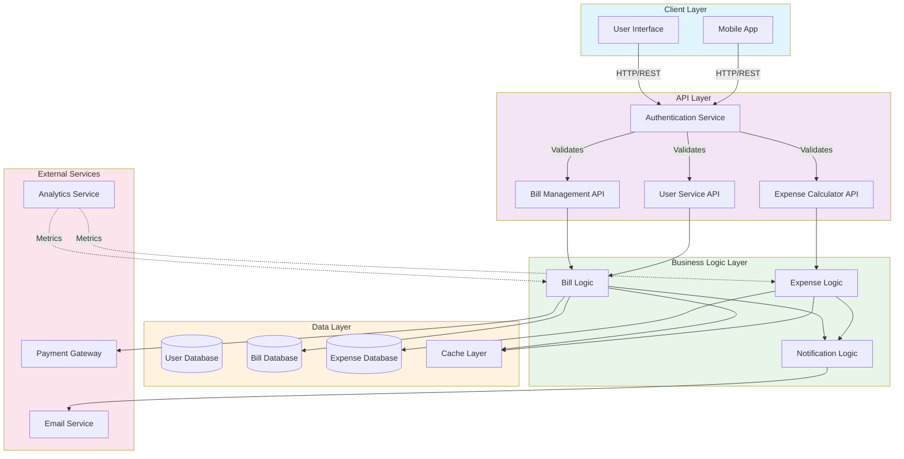

# Architecture Overview

This document provides an overview of the bill-split application architecture.

## System Architecture Diagram

## Components

### Client Layer
- **User Interface**: Web application for desktop access
- **Mobile App**: Native or cross-platform mobile application

### API Layer
- **Authentication Service**: Handles user authentication and authorization
- **Bill Management API**: Manages bill creation, updates, and retrieval
- **User Service API**: Manages user profiles and settings
- **Expense Calculator API**: Calculates and manages expense splits

### Business Logic Layer
- **Bill Logic**: Core business logic for bill operations
- **Expense Logic**: Handles expense calculations and distributions
- **Notification Logic**: Manages notifications and alerts

### Data Layer
- **User Database**: Stores user information
- **Bill Database**: Stores bill records
- **Expense Database**: Stores expense details
- **Cache Layer**: Improves performance with frequently accessed data

### External Services
- **Email Service**: Sends email notifications
- **Payment Gateway**: Processes payments
- **Analytics Service**: Tracks application metrics and usage

## Data Flow

1. Users interact with the Client Layer (Web UI or Mobile App)
2. Requests are sent to the API Layer through HTTP/REST endpoints
3. Authentication is validated before processing
4. Business Logic Layer processes the request
5. Data is persisted in the Data Layer
6. External services are invoked as needed
7. Responses are returned to the client

## Technology Stack (To be defined)

- **Frontend**: [Your frontend framework]
- **Backend**: [Your backend framework]
- **Database**: [Your database choice]
- **Cache**: [Your caching solution]
- **Deployment**: [Your deployment platform]