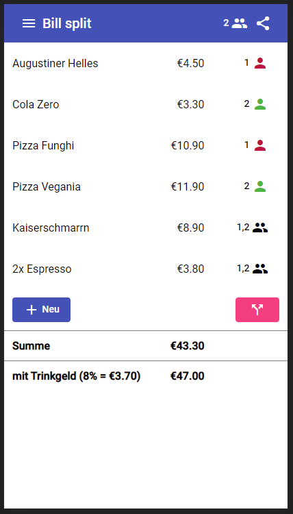
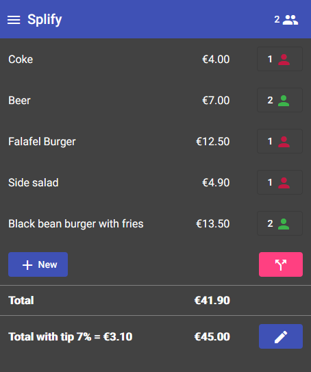

# BillSplit

Split restaurant bills between several parties. Also calculates tip.

## Link
https://tanjadi.github.io/bill-split/

## Features

- Enter items with price and select who pays for it: sharing the price equally between several parties is possible.
- Tip is calculated and rounded to have a nice total.
- Some screenshots:
  
  
